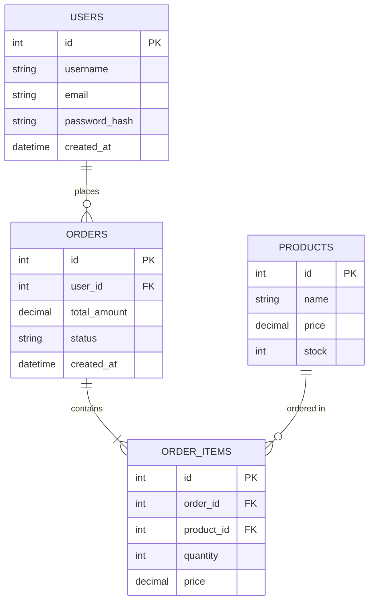

# TÀI LIỆU THIẾT KẾ CƠ SỞ DỮ LIỆU (DATABASE DESIGN DOCUMENT)

## 1. Thông tin chung về Hệ thống DB
* **Hệ quản trị CSDL đề xuất (DBMS):** [Ví dụ: PostgreSQL, MySQL, SQL Server, MongoDB...]
* **Người thực hiện (Author):** [Tên của bạn - BA / Data Architect]
* **Ngày tạo (Created Date):** [Ngày tạo tài liệu]
* **Phiên bản (Version):** [Ví dụ: 1.0]

## 2. Sơ đồ Quan hệ Thực thể (Entity Relationship Diagram - ERD)
> *Mẹo cho BA: Sử dụng các công cụ như draw.io, dbdiagram.io, hoặc Mermaid để vẽ ERD và chèn hình ảnh tại đây.*



## 3. Từ điển Dữ liệu Chi tiết (Data Dictionary / Table Schema)
Dưới đây là thiết kế chi tiết cho từng bảng cơ sở dữ liệu.

### 3.1. Bảng `USERS` (Thông tin người dùng)
* Mô tả: Lưu trữ thông tin tài khoản và thông tin cá nhân của người dùng trên hệ thống.

| Tên Trường (Field Name) | Kiểu Dữ liệu (Data Type) | Ràng buộc (Constraints) | Mô tả (Description) |
| :--- | :--- | :--- | :--- |
| `id` | INT | PK, Auto Increment | Khóa chính tự tăng của bảng |
| `username` | VARCHAR(50) | NOT NULL, UNIQUE | Tên đăng nhập của người dùng |
| `email` | VARCHAR(100) | NOT NULL, UNIQUE | Địa chỉ email dùng để liên lạc, đăng nhập |
| `password_hash` | VARCHAR(255) | NOT NULL | Mật khẩu đã được mã hóa an toàn |
| `created_at` | DATETIME | DEFAULT CURRENT_TIMESTAMP | Thời gian khởi tạo tài khoản |

### 3.2. Bảng `PRODUCTS` (Thông tin sản phẩm)
* Mô tả: Lưu trữ thông tin về các mặt hàng được bán trên website.

| Tên Trường (Field Name) | Kiểu Dữ liệu (Data Type) | Ràng buộc (Constraints) | Mô tả (Description) |
| :--- | :--- | :--- | :--- |
| `id` | INT | PK, Auto Increment | Khóa chính tự tăng của bảng |
| `name` | VARCHAR(150) | NOT NULL | Tên hiển thị của sản phẩm |
| `price` | DECIMAL(12, 2) | NOT NULL, DEFAULT 0 | Giá bán của sản phẩm |
| `stock` | INT | NOT NULL, DEFAULT 0 | Số lượng sản phẩm còn lại trong kho |

## 4. Các câu lệnh SQL mẫu để khởi tạo (Optional DDL Scripts)
Nếu cần bàn giao mã khởi tạo cơ bản cho lập trình viên:

```sql
-- Tạo bảng Users
CREATE TABLE users (
    id INT AUTO_INCREMENT PRIMARY KEY,
    username VARCHAR(50) NOT NULL UNIQUE,
    email VARCHAR(100) NOT NULL UNIQUE,
    password_hash VARCHAR(255) NOT NULL,
    created_at TIMESTAMP DEFAULT CURRENT_TIMESTAMP
);

-- Tạo bảng Products
CREATE TABLE products (
    id INT AUTO_INCREMENT PRIMARY KEY,
    name VARCHAR(150) NOT NULL,
    price DECIMAL(12, 2) NOT NULL DEFAULT 0.00,
    stock INT NOT NULL DEFAULT 0
);
```
